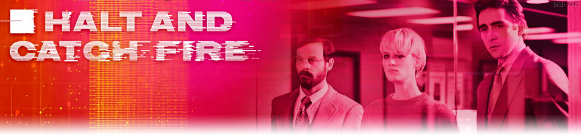

# Página de Fans: Halt and Catch Fire

 

Una página de fans dedicada a la aclamada serie de televisión "Halt and Catch Fire", que explora la revolución tecnológica de los años 80 y 90. Este proyecto busca ser un tributo a la serie, ofreciendo información detallada sobre sus temporadas, personajes y el impacto cultural y tecnológico que retrata.

Puedes visitar la página directamente aquí:

[**https://excengarrido.github.io/halt-and-catch-fire/**](https://excengarrido.github.io/halt-and-catch-fire/)

## Características

*   **Información de Temporadas:** Detalles y sinopsis de cada temporada y sus episodios.
*   **Perfiles de Personajes:** Información sobre los personajes principales y secundarios.
*   **Galería de Imágenes:** Una colección de imágenes relacionadas con la serie.
*   **Diseño Responsivo:** Adaptado para verse bien en diferentes dispositivos (escritorio, tabletas, móviles).
*   **Efectos Visuales:** Carruseles de imágenes, lightbox para ver imágenes en detalle y un efecto de máquina de escribir en la sección principal.

## Tecnologías Utilizadas

*   **HTML5:** Estructura del contenido.
*   **CSS3:** Estilos y diseño.
*   **JavaScript:** Interactividad (carruseles, lightbox, menú hamburguesa, efecto de máquina de escribir).
*   **Font Awesome:** Iconos.
*   **Google Fonts:** Tipografías personalizadas (`Share Tech Mono`, `Orbitron`).

## Cómo Usar

Si eres desarrollador y quieres ver la página de fans localmente, sigue estos pasos:

1.  Clona este repositorio:
    ```bash
    git clone https://github.com/ExcenGarrido/halt-and-catch-fire.git
    ```
2.  Navega al directorio del proyecto:
    ```bash
    cd halt-and-catch-fire
    ```
3.  Abre el archivo `index.html` en tu navegador web preferido.

## Estructura del Proyecto

```
.
├── contact.html
├── galeria.html
├── index.html
├── script.js
├── styles.css
├── temporadas.html
└── img/
    ├── Fondo1.jpg
    ├── Fondo2.jpeg
    ├── Fondo3.jpg
    ├── fondo4.jpg
    ├── gordon1.jpg
    ├── imagen1.jpg
    ├── imagen2.jpg
    ├── logo.png
    ├── logo2.jpg
    ├── logo3.jpg
    ├── logo3.png
    ├── logo4.jpg
    ├── logo5.png
    ├── portada1.jpg
    ├── temporada1.jpg
    ├── temporada2.jpg
    ├── temporada3.jpg
    ├── temporada4.jpg
    ├── unnamed.png
    └── Personajes/
        ├── CameronHowe/
        ├── DonnaClark/
        ├── GordonClark/
        ├── JoeMacMillan/
        └── Secundarios/
```

## Contacto

Si tienes alguna pregunta o sugerencia, no dudes en contactarme a través de mi perfil de GitHub.

---

¡Espero que disfrutes explorando el mundo de "Halt and Catch Fire"!
